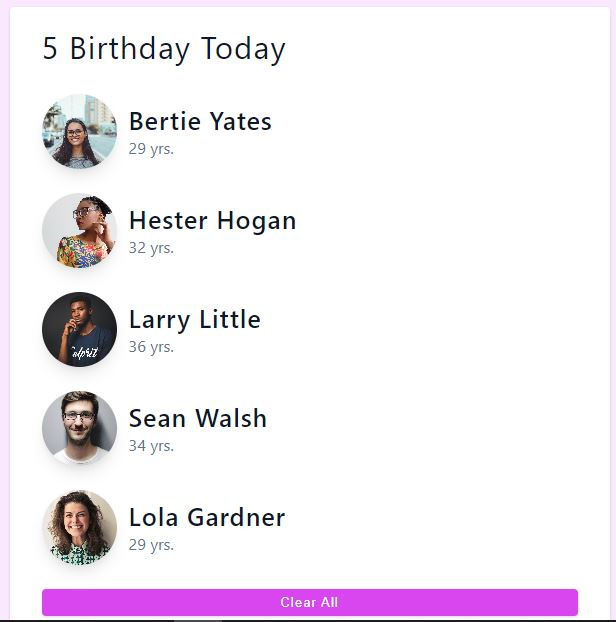

# Project - Birthday Buddy

## Project Details :

_Build an app ..._

- Project Live Link : 

### Technology Used -

- HTML
- CSS
- ReactJS

### Key Learnings from the project -

1. Project Planning & its Execution
2. Key Project Structure & its elements
3. Various usage of HTML, CSS and its properties
4. Key Elements design in CSS
5. Writing code block by block to build overall ReactJS project
6. Import Data in React
7. Setup State Variable in React
8. Iterate, Render & Clearing the list in React
9. Project Testing
10. Github & Vercel utilisation

- Project Live Link : 

### - Developed by [Aniruddha](https://github.com/AniruddhaDas1) | CoderX Community | [Send Message to WhatsApp](https://wa.me/9123987124)
